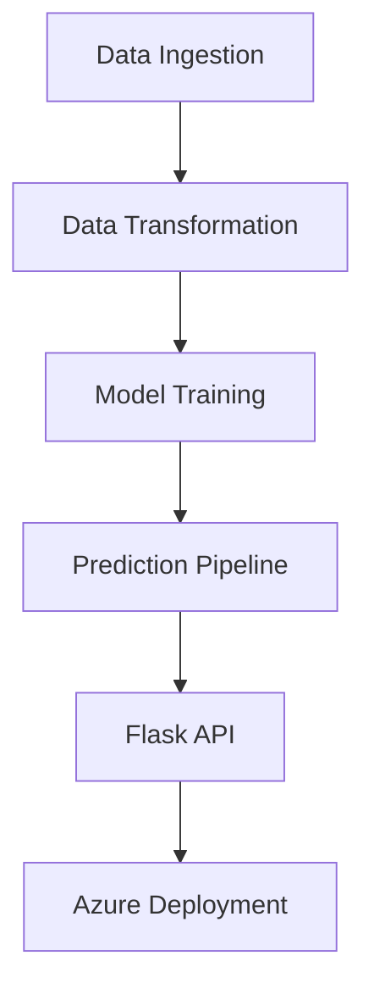

# 🎯 End-to-End Machine Learning Project with Deployment

A production-grade machine learning pipeline for predicting student math scores based on demographic and academic features. The entire workflow includes automated data ingestion, preprocessing, model training, evaluation, and deployment using Flask and Azure App Service.
---

## ✨ Key Features

- 🔁 **Automated Pipeline**: Data ingestion → transformation → model training → deployment
- 🧠 **Hyperparameter Tuning**: GridSearchCV across 7+ models (XGBoost, CatBoost, Random Forest, etc.)
- 🚨 **Robust Exception Handling**: Custom logging with detailed error tracebacks
- 🔧 **CI/CD Integration**: GitHub Actions pipeline for automated Azure deployment
- 🧹 **Scalable Preprocessing**: `ColumnTransformer` to handle mixed feature types

---

## 🧠 Tech Stack

| Component         | Technologies Used                                    |
|------------------|------------------------------------------------------|
| **Backend**       | Python 3.8, Flask                                    |
| **Machine Learning** | Scikit-learn, XGBoost, CatBoost, Pandas, NumPy    |
| **Infrastructure** | Azure App Service, GitHub Actions (CI/CD)          |
| **Monitoring**    | Azure Log Analytics, Custom Python Logging          |

---

## 📁 Pipeline Architecture

☁️ Azure Deployment

    Configure GitHub Secrets for:

        AZURE_WEBAPP_NAME

        AZURE_CREDENTIALS_JSON

    Push to main branch to auto-deploy via GitHub Actions

## 📊 Model Performance

| Model         | Test R² Score |
|---------------|---------------|
| XGBoost       | 0.92          |
| CatBoost      | 0.91          |
| Random Forest | 0.89          |

NOTE: Complete code is in a different private repository.
